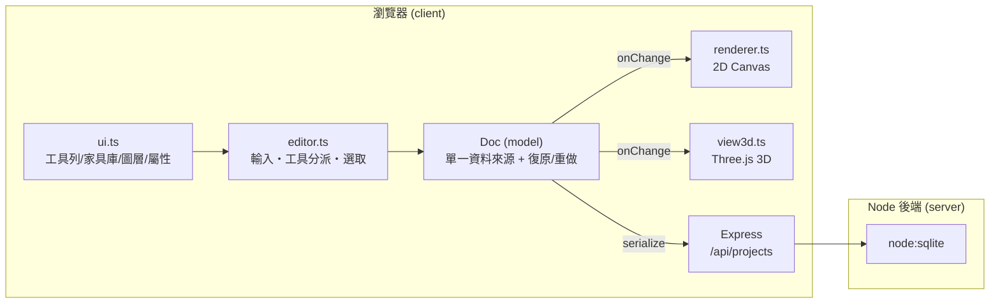

# 室內設計繪圖 · Interior Designer

一套**2D／3D 室內平面圖設計工具**。在 2D 畫布上畫牆、樑、門窗、房間、擺放家具、標註尺寸，隨時切換到即時 **3D 檢視**（Three.js）預覽空間，並可匯出 **PNG／PDF／glTF(.glb)**。

前端以**原生 Canvas + TypeScript** 手刻（座標轉換、選取縮放旋轉、圖層、吸附、曲線牆、房間偵測皆自行實作），後端是 **Node + Express + `node:sqlite`** 的輕量存檔服務。

---

## 目錄

1. [功能總覽](#功能總覽)
2. [技術棧](#技術棧)
3. [系統架構](#系統架構)
4. [安裝與執行](#安裝與執行)
5. [目錄結構](#目錄結構)
6. [核心原理（詳解）](#核心原理詳解)
7. [操作說明](#操作說明)
8. [資料格式](#資料格式)
9. [測試](#測試)
10. [須知與注意事項](#須知與注意事項)
11. [未來可擴充](#未來可擴充)

---

## 功能總覽

| 類別 | 功能 |
|------|------|
| **繪製** | 直線牆、曲線牆（弧度）、樑（從天花板往下垂）、門、窗、房間、尺寸標註 |
| **門窗樣式** | 門：單開／雙開／推拉／玻璃；窗：格窗／橫拉／平開／景觀 |
| **家具** | 依房間分類（客廳／餐廳／臥室／廚房／浴室／書房），含多種櫃子（收納櫃、餐邊櫃、五斗櫃、衣櫃、展示櫃…），皆為程式繪製的俯視圖示 + 對應 3D 模型 |
| **房間** | 由封閉牆體**自動偵測**成房間並計算面積（含曲線牆弧形面積）；可命名、選地板材質 |
| **多樓層** | 每層獨立物件，設定樓層高程，3D 中依高程堆疊 |
| **圖層** | 牆體／樑／門窗／房間／尺寸／底圖等圖層，顯示、鎖定、上下排序 |
| **3D 檢視** | 即時 Three.js 渲染：牆體挖洞、擬真 PBR 材質、時段光照（早晨／正午／黃昏／夜晚）、環境光遮蔽（GTAO）、天空、陰影；WASD 飛行 |
| **編輯** | 選取／框選、拖曳移動、角落縮放、旋轉、端點拖曳、方向鍵微調、對齊/均分、複製貼上、復原/重做 |
| **匯出** | PNG（Canvas）、PDF（jsPDF）、3D 模型 .glb（glTF，可用 Blender 開啟） |
| **持久化** | 後端 SQLite 存檔；離線自動降級為 localStorage；每 30 秒自動存檔 |
| **底圖** | 匯入平面圖底圖描繪，並可自動偵測牆體 |

---

## 技術棧

- **前端**：TypeScript + Vite；2D 用原生 HTML5 Canvas 手刻；3D 用 [Three.js](https://threejs.org/)（含 `EffectComposer` / `GTAOPass` / `RoomEnvironment` IBL）；PDF 用 `jsPDF`。
- **後端**：Node.js + Express + `node:sqlite`（Node 內建，免裝原生模組）。
- **建置**：npm workspaces（`client` / `server`）、Vite、`tsx`。
- **測試**：Node 內建 test runner，透過 `tsx --test` 執行。
- **單位**：公分（cm）。座標系 **x 向右、y 向下**（螢幕座標習慣）。

---

## 系統架構



- **前端**在 `:5180`（Vite），**後端**在 `:8791`（Express）。Vite 設定把 `/api` 代理到 `:8791`。
- 前端是「**保留式資料 + 即時繪製**」：所有狀態集中在 `Doc`，任何變更觸發 `onChange`，2D 與 3D 各自重繪。
- 後端只負責**專案存檔**。

---

## 安裝與執行

需求：**Node.js ≥ 22**（`node:sqlite` 的 `DatabaseSync` 需要）。

```bash
cd interior-designer
npm install
npm run dev          # 同時起：後端 :8791 + 前端 :5180
# 打開 http://localhost:5180
```

其他指令：

```bash
npm run build        # server (tsc) + client (tsc --noEmit && vite build)
npm start            # 以編譯後的後端啟動
npm test             # 執行 client/test/*.test.ts
```

> 後端離線時前端仍可用：存檔會自動改用瀏覽器 `localStorage`。

---

## 目錄結構

```
interior-designer/
├─ client/                         # 前端（Vite）
│  ├─ index.html                   # 版面骨架（工具列、左家具庫、中畫布、右圖層/屬性/AI）
│  └─ src/
│     ├─ main.ts                   # 進入點：建立 editor + view3d，2D/3D 切換與子母畫面
│     ├─ model/
│     │  ├─ types.ts               # Obj 聯集型別、Project/Floor、圖層、門窗樣式常數
│     │  └─ doc.ts                 # Doc：多樓層文件、CRUD、復原/重做、genId
│     ├─ core/
│     │  ├─ viewport.ts            # 世界↔螢幕座標、平移/縮放
│     │  ├─ renderer.ts            # 2D Canvas 繪製（物件、標籤、尺寸）
│     │  ├─ geometry.ts            # 向量/弧線數學、arcOpening/arcSpan、多邊形面積、吸附
│     │  ├─ hit.ts                 # 命中測試與包圍盒
│     │  ├─ handles.ts             # 選取控制點
│     │  ├─ editor.ts              # 輸入事件、工具分派、選取、剪貼簿、對齊、縮放
│     │  ├─ rooms.ts               # 由牆體平面圖偵測房間（含曲線牆弧線細分）
│     │  ├─ detect.ts              # 從底圖影像自動偵測牆線
│     │  ├─ exporter.ts            # PNG / PDF 匯出
│     │  ├─ view3d.ts              # Three.js 3D 場景、牆體挖洞、平滑曲面、光照、GLB 匯出
│     │  ├─ furniture3d.ts         # 家具 3D 模型（PBR 材質原型、各式櫃體）
│     │  └─ textures3d.ts          # 木地板 / 磁磚材質
│     ├─ tools/
│     │  ├─ types.ts               # Tool 介面
│     │  ├─ draw.ts                # WallTool / CurvedWallTool / BeamTool / RoomTool / DimensionTool / PanTool
│     │  ├─ place.ts               # OpeningTool（門窗吸附牆體）、FurnitureTool、fitOpeningToWall
│     │  └─ select.ts              # 選取、移動、縮放、旋轉、端點拖曳
│     ├─ data/furniture.ts         # 家具目錄（俯視圖示 + 尺寸 + 參考價）
│     ├─ ui/ui.ts                  # 全部 UI 接線：家具庫、樓層、圖層、屬性、頂列、匯出選單、AI、自動存檔、房間重建
│     └─ net/api.ts                # 專案 CRUD（含離線 localStorage 降級）
├─ server/                         # 後端（Express + node:sqlite）
│  └─ src/
│     ├─ index.ts                  # 路由：/api/health、/api/projects CRUD
│     └─ db.ts                     # node:sqlite（DatabaseSync）專案存取
└─ client/test/                    # 單元測試（doc / geometry / rooms / place）
```

---

## 核心原理（詳解）

### 1. 資料模型：`Doc` 是唯一真相來源

所有畫面上的東西都是 `Obj` 聯集型別的一員（`client/src/model/types.ts`）：

```ts
type ObjKind = 'wall' | 'beam' | 'room' | 'door' | 'window' | 'furniture' | 'dimension' | 'image';
type Obj = Wall | Beam | Room | Opening | Furniture | Dimension | ImageObj;
```

三種座標表示法：
- **有 a/b 端點**：`Wall`、`Beam`、`Dimension`（線段/曲線）。
- **有 x/y/w/h 包圍盒**：`Room`、`Furniture`、`ImageObj`。
- **有 x/y/width/angle**：`Opening`（門/窗，貼在牆上，`bulge` 讓它隨曲線牆彎曲，`style` 決定樣式）。

`Doc`（`model/doc.ts`）管理**多樓層**：`Project.floors: Floor[]` + `activeFloorId`。`doc.objects` 這個 getter 指向「目前作用樓層」的物件，所有工具都對它操作。3D 依 `floor.elevation` 疊放各層。

`Doc` 對外提供 `add / update(id, patch) / remove(id) / select / serialize / load`，並用一組 `onChange` 監聽器廣播變更 —— 這是整個 App 的心跳：**任何資料變更 → 通知 → 2D 重繪、3D 重建、圖層/屬性面板刷新、自動存檔、房間重建**。

### 2. 復原／重做：快照式

`Doc` 在**每次會改變資料的操作之前**呼叫 `commit()`，把目前 `project` 深拷貝推入 undo 堆疊；`undo/redo` 就在堆疊間切換整份文件。工具在開始一段互動（例如按下滑鼠、聚焦輸入框）時呼叫一次 `commit()`，把整段連續操作併成一個可復原步驟。

### 3. 座標系統與視口

`viewport.ts` 負責世界（cm）↔螢幕（px）轉換：`scale` = 每公分幾像素，`origin` = 視口左上對應的世界座標。`toScreen / toWorld` 互轉，`pan` 改 `origin`，`zoomAt` 以某螢幕點為中心縮放。頂列的 −／＋ 按鈕呼叫 `editor.zoomBy()`，滾輪則呼叫 `zoomAt`。

### 4. 2D 渲染

`renderer.ts` 是**即時模式**繪製：每幀清空畫布，套用視口變換，依 `doc.objects` 逐一 `drawObject`，再畫選取控制點、尺寸標籤等。牆是描邊線段（曲線牆用二次貝茲曲線），門畫開門弧線、窗畫雙線 + 窗櫺，家具呼叫 `data/furniture.ts` 裡各品項的 `draw()` 俯視圖示。

### 5. 工具系統

每個工具實作 `Tool` 介面（`onDown/onMove/onUp/onKey/deactivate` + `cursor/hint`）。`editor.ts` 把指標事件轉成世界座標後轉發給「目前作用工具」。工具清單：

- `draw.ts`：`WallTool`（連點放端點）、`CurvedWallTool`（點兩端 → 移動設弧度 → 再點確認）、`BeamTool`、`RoomTool`、`DimensionTool`、`PanTool`。
- `place.ts`：`OpeningTool`（門/窗，游標貼近牆自動吸附）、`FurnitureTool`。
- `select.ts`：選取/框選、平移、角落縮放、旋轉、端點拖曳。

### 6. 吸附（Snapping）

頂列「吸附」開關控制：畫牆/移動時端點吸附到**格線**，以及吸附到**其他牆的端點或線段**（`geometry.ts` 的 `nearestWallSnap`）—— 這是房間能自動封閉的關鍵（牆角要真的接上）。畫牆時接近水平/垂直會自動拉直；按 **Shift** 可暫時強制軸向。

### 7. 曲線牆與門窗貼合

曲線牆以**二次貝茲曲線**表示：牆存 `bulge`（弧的垂距），控制點由 `wallControl(a,b,bulge)` 算出，使曲線中點正好落在弧頂。

門窗要貼在牆上：`place.ts` 的 `fitOpeningToWall` 找最近的牆，直線牆取投影點，曲線牆用 `arcOpening`（以游標為中心、沿弧線各走半個寬度）算出貼合的位置、角度與 `bulge`。**拖曳端點調整寬度**時改用 `arcSpan`（把「固定端 + 拖曳端」各投影到弧上，取兩點之間的子弧段）—— 固定端本來就在弧上，所以一定吸附得到，且窗戶可一路拉伸到整道牆而不會中途縮水。

### 8. 房間自動偵測

`rooms.ts` 把牆體視為**平面圖（planar graph）**：合併相近端點成節點、建立無向邊，再用**半邊（half-edge）繞行**找出所有被牆圍住的有界面，捨棄最外圈的無界面。分隔牆會正確切出兩個房間。回傳的多邊形會把**曲線牆沿弧線細分**，因此房間面積（與 3D 地板）能正確跟隨曲線。牆體一有變動就以 150ms debounce 重新偵測，並保留使用者手動命名/移動過的房間。

### 9. 3D 檢視（Three.js）

`view3d.ts` 把平面座標 `(x, y)` 映到 3D 的 `(X=x, Z=y, Y=up)`：

- **牆體挖洞**：直線牆沿牆長切成「開口前實牆 → 窗台 → 楣樑 → 開口後實牆」的區段，真正挖出門窗洞。
- **平滑曲面**：曲線牆與其上的曲線窗改用 `sweptWall()`—— 沿弧線建**單一連續帶狀網格**，兩側牆面共用頂點讓 `computeVertexNormals` 平滑著色（消除分段刻面），頂面與端蓋則保留銳利邊。
- **擬真材質**：`furniture3d.ts` 定義 PBR 材質原型 —— 上漆木材（clearcoat）、拉絲金屬、霧面布料、上釉陶瓷、拋光石材、有色玻璃 —— 依物件套用；圓角盒體用 `RoundedBoxGeometry`。
- **門窗樣式**：`buildDoor3D / buildWindow3D` 依 `style` 建出雙葉門、推拉門、玻璃門、格窗/中挺/整片玻璃等不同形體。
- **光照**：四段時段預設（早晨／正午／黃昏／夜晚）調整太陽方向/強度、半球光、環境光、曝光與天空色；`RoomEnvironment` 提供 IBL 反射；`GTAOPass` 加環境光遮蔽；`PCFSoftShadowMap` 柔和陰影（只在重建時更新一次以省效能）。
- **GLB 匯出**：動態載入 `GLTFExporter`，把牆/地板/門窗/家具（不含無限地板與天空）輸出成 `.glb`。

### 10. 家具 3D 模型

`furniture3d.ts` 用基本幾何組裝出各家具（沙發的軟包扶手、床的床頭/被子/枕頭、植栽的葉片、各式櫃體）。櫃子用可組態的 `cabinetModel`（斜腳/踢腳/圓腳、石檯面+洗手盆、抽屜排、凹槽門板、圓鈕/長把手），加上抽屜櫃、開放層架、玻璃展示櫃等專屬 builder，讓每種櫃子外形分明。模型依 `(item, w, h)` 快取，重複擺放時 `clone()`。

### 11. 持久化與自動存檔

`net/api.ts` 對後端做 CRUD（`/api/projects`），連不上時自動改用 `localStorage`（`apiState.online` 標記）。自動存檔採 **30 秒心跳**：每次變更只把文件標記為 dirty，30 秒定時器才實際存檔並顯示「已自動儲存 時間」；離開頁面（`beforeunload`）會盡力再存一次，避免遺失最後 <30 秒。後端 `db.ts` 用 `node:sqlite` 的 `DatabaseSync`，把整份專案 JSON 存進 `projects` 表。

---

## 操作說明

| 功能 | 操作 |
|------|------|
| 平移畫布 | 按住**空白鍵拖曳**、**中鍵拖曳**，或（2D 主視圖時）**WASD** |
| 縮放 | 滑鼠**滾輪**，或頂列 **−／＋** 按鈕（點百分比重設 100%） |
| 選取 | `V` |
| 平移工具 | `H` |
| 窗 / 尺寸 | `N` / `M` |
| 直線牆 / 曲線牆 / 樑 / 門 | 由左側「常用」面板按鈕選取（W/A/S/D 保留給相機，故不設快捷鍵） |
| 家具 | 左側家具庫點選 → 在畫布點擊放置 |
| 選取後 | 拖曳移動、角落縮放、上方圓點旋轉、端點拖曳、方向鍵微調、`Delete` 刪除 |
| 複製 / 貼上 / 再製 | `⌘/Ctrl + C` / `V` / `D` |
| 復原 / 重做 | `⌘/Ctrl + Z` / `⌘/Ctrl + Shift + Z`（或 `⌘/Ctrl + Y`） |
| 回到選取 / 取消 | `Esc` |
| 切換 2D / 3D | 頂列「切換 3D 檢視」；3D 中用 **WASD 移動、Q/E 升降、拖曳旋轉、滾輪縮放** |

右側面板可調整選取物件的**屬性**、管理**圖層**（可折疊）與**樓層**。

---

## 資料格式

一份專案（`Doc.serialize()` 的回傳，也就是存進後端的內容）大致長這樣：

```jsonc
{
  "id": "proj_…",
  "name": "未命名平面圖",
  "activeFloorId": "floor_1",
  "layers": [ { "id": "walls", "name": "牆體", "visible": true, "locked": false, "color": "#…" } ],
  "floors": [
    {
      "id": "floor_1", "name": "1F", "elevation": 0,
      "objects": [
        { "id": "wall_…", "kind": "wall", "layer": "walls",
          "a": { "x": 0, "y": 0 }, "b": { "x": 400, "y": 0 }, "thickness": 12, "bulge": 0 },
        { "id": "window_…", "kind": "window", "layer": "openings",
          "x": 200, "y": 0, "width": 120, "angle": 0, "style": "single", "elevation": 90 },
        { "id": "furn_…", "kind": "furniture", "layer": "furniture",
          "item": "sofa", "x": 50, "y": 155, "w": 200, "h": 90, "angle": 0, "label": "沙發" }
      ]
    }
  ]
}
```

長度單位一律 cm；角度為度。

---

## 測試

以 Node 內建 test runner + `tsx` 執行，涵蓋幾何、房間偵測、門窗貼合、文件模型等純邏輯：

```bash
npm test
```

- `geometry.test.ts` — 向量/弧線/多邊形數學
- `rooms.test.ts` — 房間偵測（含曲線牆面積）
- `place.test.ts` — 門窗貼合曲線牆
- `doc.test.ts` — 文件與復原/重做

---

## 須知與注意事項

- **Node 版本**：需 **≥ 22**，因為後端用內建 `node:sqlite`（`DatabaseSync`）。
- **單位固定 cm**：所有座標/尺寸都是公分；AI 工具與匯出皆以此為準。
- **離線可用**：後端連不上時自動改用 `localStorage`，但那是瀏覽器本機、非跨裝置。
- **自動存檔是 30 秒週期**：不是即時；離開頁面會盡力補存，但極端情況（當機）可能遺失最後幾秒。手動「儲存」可立即存。
- **座標系 y 向下**：與螢幕一致；3D 中對應 Z 軸，Y 為上。
- **曲線牆效能**：3D 曲線牆會細分成密集網格（平滑用），以每次重建為單位處理，一般使用無虞。
- **開發時的相機鍵**：W/A/S/D 在 2D 平移視圖、在 3D 飛行相機，因此**未**設為工具快捷鍵。
- **家具**：擴充家具請同步更新 `data/furniture.ts`（2D 圖示 + 尺寸）與 `furniture3d.ts`（3D 模型）。

---

## 未來可擴充

- 更多吸附（中點/牆面/平行）、尺寸鏈、對齊輔助線。
- 白底列印主題、比例尺與圖框、多頁 PDF、家具估價清單。
- 匯入自訂家具、群組、貼齊網格設定。
- 房間內部標註（面積/名稱）自動排版、材料表輸出。
