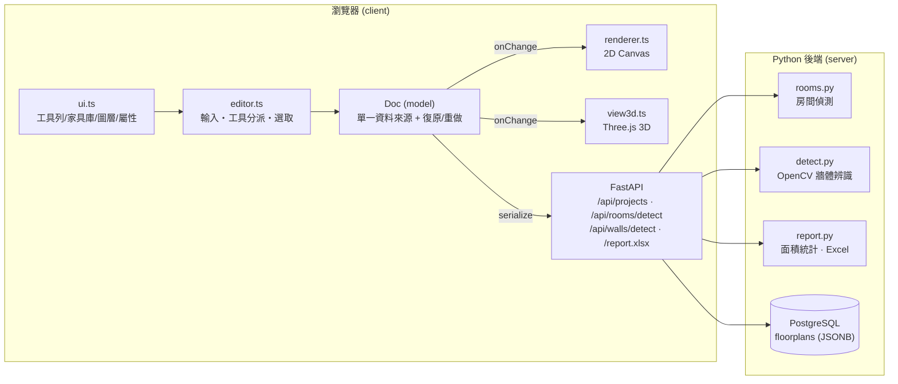

# 室內設計繪圖 · Interior Designer

一套**2D／3D 室內平面圖設計工具**。在 2D 畫布上畫牆、樑、門窗、房間、擺放家具、標註尺寸，隨時切換到即時 **3D 檢視**（Three.js）預覽空間，並可匯出 **PNG／PDF／glTF(.glb)**。

前端以**原生 Canvas + TypeScript** 手刻（座標轉換、選取縮放旋轉、圖層、吸附、曲線牆皆自行實作），後端是 **Python + FastAPI + PostgreSQL**，負責存檔、房間偵測、底圖牆體辨識與報表。

---

## 目錄

1. [功能總覽](#功能總覽)
2. [技術棧](#技術棧)
3. [系統架構](#系統架構)
4. [安裝與執行](#安裝與執行)
5. [用 Docker 執行](#用-docker-執行windows--macos--linux)
6. [打包成單機軟體](#打包成單機軟體)
7. [目錄結構](#目錄結構)
8. [核心原理（詳解）](#核心原理詳解)
9. [操作說明](#操作說明)
10. [資料格式](#資料格式)
11. [測試](#測試)
12. [須知與注意事項](#須知與注意事項)
13. [未來可擴充](#未來可擴充)

---

## 功能總覽

| 類別 | 功能 |
|------|------|
| **繪製** | 直線牆、曲線牆（弧度）、樑（從天花板往下垂）、門、窗、房間、尺寸標註；**尺寸鏈自動標註**（沿牆在門窗與交會處逐段斷開） |
| **門窗樣式** | 門：單開／雙開／推拉／玻璃；窗：格窗／橫拉／平開／景觀 |
| **家具** | 依房間分類（客廳／餐廳／臥室／廚房／浴室／書房），含多種櫃子（收納櫃、餐邊櫃、五斗櫃、衣櫃、展示櫃…），皆為程式繪製的俯視圖示 + 對應 3D 模型；**可自訂材質顏色**（八組常用飾面 + 自訂色），2D 與 3D 同步 |
| **水電配置** | 插座／開關／燈具共 14 種符號，依慣例繪製並帶標準安裝高度（插座 30cm、檯面上 110cm、開關 120cm）；插座開關**自動貼牆並轉向**，燈具可自由放置 |
| **群組** | ⌘G 組成群組、⇧⌘G 解散；選取其一即選取整組，移動／縮放／複製／刪除皆以整組為單位 |
| **房間** | 由封閉牆體**自動偵測**成房間並計算面積（含曲線牆弧形面積）；可命名、選地板材質 |
| **多樓層** | 每層獨立物件，設定樓層高程，3D 中依高程堆疊 |
| **圖層** | 牆體／樑／門窗／房間／尺寸／底圖等圖層，顯示、鎖定、上下排序 |
| **3D 檢視** | 即時 Three.js 渲染：牆體挖洞、**房間天花板**（僅在相機位於室內時顯示）、擬真 PBR 材質、時段光照（早晨／正午／黃昏／夜晚）、環境光遮蔽（GTAO）、天空、陰影；WASD 飛行 |
| **編輯** | 選取／框選、拖曳移動、角落縮放、旋轉、端點拖曳、方向鍵微調、對齊/均分、複製貼上、復原/重做 |
| **智慧吸附** | 畫牆／樑與拖曳端點時貼合牆體**端點／中點／牆面**（不同圖示：圈=端點、三角=中點、菱形=牆面），並在與既有端點**水平／垂直對齊**時顯示橙色虛線輔助線；兩條輔助線交會即吸附至交點 |
| **報表** | 各樓層房間面積（m²／坪）、家具數量、**水電配件數量**、物件統計，可匯出 **Excel (.xlsx)** |
| **匯出** | PNG（Canvas）、PDF 快照、**施工圖 PDF**（真實比例＋圖框／標題欄／比例尺／房間面積表，每樓層一頁）、**360 全景**（4096×2048 equirectangular JPG ＋ 可直接雙擊開啟的自包含 HTML 檢視器）、3D 模型 .glb（glTF，可用 Blender 開啟） |
| **持久化** | 後端 PostgreSQL 存檔（JSONB）；離線寫入本機鏡像並在連線後補送；變更後約 0.7 秒 debounce 自動存檔（另有 20 秒 fallback 心跳兼補送） |
| **底圖** | 匯入平面圖底圖描繪，並可自動偵測牆體（後端 OpenCV） |
| **DXF 匯入** | 讀入建商／測繪提供的 DXF：先列出圖層與線段統計供勾選，再轉成牆體（自動合併雙線牆並量出厚度、ARC 與 bulge 轉曲線牆、單位可覆寫）。選到 `.dwg` 會顯示轉檔指引 —— 見下方說明 |

---

## 技術棧

- **前端**：TypeScript + Vite；2D 用原生 HTML5 Canvas 手刻；3D 用 [Three.js](https://threejs.org/)（含 `EffectComposer` / `GTAOPass` / `RoomEnvironment` IBL）；PDF 用 `jsPDF`。
- **後端**：Python 3 + FastAPI + SQLAlchemy + PostgreSQL；影像處理用 OpenCV，DXF 用 ezdxf，報表用 openpyxl。
- **建置**：npm workspace（`client`）、Vite、`tsx`；後端用 venv + `requirements.txt`。
- **測試**：前端用 Node 內建 test runner（`tsx --test`），後端用 pytest；`npm test` 兩套一起跑。
- **單位**：公分（cm）。座標系 **x 向右、y 向下**（螢幕座標習慣）。

---

## 系統架構


```mermaid
flowchart LR
  subgraph Browser["瀏覽器 (client)"]
    UI["ui.ts<br/>工具列/家具庫/圖層/屬性"]
    Editor["editor.ts<br/>輸入・工具分派・選取"]
    Doc["Doc (model)<br/>單一資料來源 + 復原/重做"]
    R2D["renderer.ts<br/>2D Canvas"]
    V3D["view3d.ts<br/>Three.js 3D"]
    UI --> Editor --> Doc
    Doc -- onChange --> R2D
    Doc -- onChange --> V3D
    Doc -- serialize --> API
  end
  subgraph Server["Python 後端 (server)"]
    API["FastAPI<br/>/api/projects · /api/rooms/detect<br/>/api/walls/detect · /report.xlsx"]
    ROOMS["rooms.py<br/>房間偵測"]
    DETECT["detect.py<br/>OpenCV 牆體辨識"]
    REPORT["report.py<br/>面積統計 · Excel"]
    DB[("PostgreSQL<br/>floorplans (JSONB)")]
    API --> ROOMS
    API --> DETECT
    API --> REPORT
    API --> DB
  end
```

- **前端**在 `:5180`（Vite），**後端**在 `:8791`（FastAPI/uvicorn）。Vite 設定把 `/api` 代理到 `:8791`。
- 前端是「**保留式資料 + 即時繪製**」：所有狀態集中在 `Doc`，任何變更觸發 `onChange`，2D 與 3D 各自重繪。
- 後端只負責**專案存檔**。

---

## 安裝與執行

需求：**Node.js ≥ 20**、**Python ≥ 3.11**、**PostgreSQL**（預設連線 `postgresql+psycopg://localhost/interior_design`，可用 `DATABASE_URL` 覆寫）。

```bash
cd interior-designer
npm install
npm run setup:py     # 建立 .venv 並安裝後端依賴
createdb interior_design
npm run assets       # 選配：抓 127 件 CC0 家具模型（約 41MB，跑一次就好）
npm run dev          # 同時起：FastAPI :8791 + Vite :5180
# 打開 http://localhost:5180
```

`npm run assets` 是**選配**，但強烈建議跑。那 41MB 沒有進 repo——不是每個人都需要，
而 clone 的代價是每個人都要付。**不跑也能用**：家具改用程式生成的幾何，不會報錯。
只是那不是等價的替代品，早期那批（沙發、衣櫃、家電）有手寫幾何，後來以模型為前提
加的七十幾件會退成素方塊。要的時候隨時補跑，不用重裝任何東西。

若要從舊的 SQLite 存檔搬資料到 PostgreSQL：

```bash
npm run migrate      # 可重複執行；加 --dry-run 先看會寫什麼
```

其他指令：

```bash
npm run build        # client (tsc --noEmit && vite build)
npm start            # 以正式模式啟動 FastAPI
npm test             # 型別檢查 + codegen 新鮮度 + 前端 tsx --test + 後端 pytest
```

> 後端離線時前端仍可**繪圖與存檔**（寫進瀏覽器的本機鏡像，連線後自動補送），但房間偵測、底圖牆體辨識與報表需要後端。房間偵測失敗時會保留現有房間而不是刪除它們。

---

## 用 Docker 執行（Windows / macOS / Linux）

只要有 Docker Desktop，不需要在機器上裝 Node、Python 或 PostgreSQL。

```bash
git clone https://github.com/bruuucechang/interiordesign.git
cd interiordesign
docker compose up --build
```

開 <http://localhost:18791>（對外埠刻意避開 8791，見下方常見狀況）。第一次建置約 2～3 分鐘（下載 Node 與 Python 映像、安裝依賴、建置前端），之後有快取就很快；容器啟動到可用約 3 秒。

已在 **linux/arm64** 與 **linux/amd64** 兩種架構實際建置並執行驗證過（Windows 筆電通常是 amd64）。

包含兩個服務：**PostgreSQL**，以及一個同時提供 API 與已建置前端的容器。前端全部使用相對路徑 `/api/...`，同源提供服務所以不需要任何 proxy 或 CORS 設定。

平面圖存在 `pgdata` volume，重新建置不會消失；要清空資料是 `docker compose down -v`。

### 開發模式（改程式碼會熱重載）

```bash
docker compose -f docker-compose.dev.yml up --build
```

開 <http://localhost:5180>。原始碼從主機掛載進容器，前端走 Vite dev server、後端 `uvicorn --reload`，兩邊改了都會自動重載。PostgreSQL 另外開在 `localhost:5432`（帳密皆為 `interior`），方便用 psql 或 GUI 工具連。

> 容器內的 Vite 用輪詢偵測檔案變更 —— Windows 與 macOS 的 bind mount 不保證把 inotify 事件送進容器。

### 常見狀況

| 狀況 | 原因與處理 |
|---|---|
| `port is already allocated` | 本機已有服務佔用 18791／5180／5432。停掉它，或改 compose 檔裡的對外埠號 |
| Windows 上綁埠失敗且錯誤看起來無關 | 8791 落在 Hyper-V 的動態保留範圍（如 8712–8811），會**靜默失敗**。對外埠因此改成 18791；`netsh interface ipv4 show excludedportrange protocol=tcp` 可看保留段 |
| 前端改了沒反應 | 確認你用的是 `docker-compose.dev.yml`；production compose 的前端是建置好的靜態檔，要改就得重新 `--build` |
| 想從頭來過 | `docker compose down -v` 會連資料庫 volume 一起刪除 |

### 不用 Docker（原生執行）

見上方的「安裝與執行」；需要自行準備 Node ≥ 20、Python ≥ 3.11 與 PostgreSQL。

---

## 打包成單機軟體

給不想碰 Docker、Node 或 Python 的人：一個資料夾，點兩下就開。程式會在本機起一個
伺服器、用預設瀏覽器打開它，並把圖存到使用者自己的目錄。

```bash
./build-desktop.sh        # macOS / Linux
build-desktop.bat         # Windows
```

產出在 `dist/InteriorDesigner/`（約 165 MB，含 OpenCV 與 Python 直譯器）。
把整個資料夾壓縮起來就是可下載的軟體；使用者解壓後執行裡面的 `InteriorDesigner`
（Windows 是 `InteriorDesigner.exe`）。

**必須在目標平台上建置。** PyInstaller 是把當下這台機器的直譯器和二進位擴充模組凍結
起來，不能交叉編譯——Windows 版要在 Windows 上跑 `build-desktop.bat`。

### 單機版與伺服器版的差異

| | 單機版 | Docker / 伺服器版 |
|---|---|---|
| 資料庫 | SQLite 單一檔案 | PostgreSQL |
| 資料位置 | macOS `~/Library/Application Support/InteriorDesigner/`<br>Windows `%APPDATA%\InteriorDesigner\` | 容器磁碟區 |
| 埠 | 8791，被占用時自動改用其他埠 | 18791（容器內 8791） |
| 多人共用 | 否 | 是 |

由 `DATABASE_URL` 決定走哪一邊，`server/app/db.py` 兩種都支援；資料欄位用通用的 JSON
型別而非 PostgreSQL 專屬的 JSONB，同一份模型才能兩邊通用。

### 已知限制

- **視窗就是瀏覽器分頁**，關掉主控台視窗才是結束程式。要做成原生視窗得改用 Tauri 或
  Electron，那是另一套建置流程。
- **沒有程式碼簽章**，macOS Gatekeeper 會擋（右鍵「打開」可略過），Windows SmartScreen
  會跳警告。要消掉這些警告需要付費憑證（Apple Developer 年費 99 美元、Windows 簽章憑證
  約年費 200 美元）。
- **macOS 第一次啟動要等 30 秒左右**，之後降到 1.5 秒。原因不是磁碟或程式本身：把檔案
  預先讀進快取沒有改善，而取樣顯示 `XprotectService` 在那段時間吃滿一顆核心——macOS 內建
  的惡意軟體掃描在逐一檢查包裡 284 個未簽章的動態函式庫。每份新解壓的複本都會再掃一次。
  簽章與公證（notarization）可以免除，但需要付費的開發者憑證。

---

## 目錄結構

```
interior-designer/
├─ client/                         # 前端（Vite）
│  ├─ index.html                   # 版面骨架（工具列、左家具庫、中畫布、右圖層/屬性）
│  └─ src/
│     ├─ main.ts                   # 進入點：建立 editor + view3d，2D/3D 切換與子母畫面
│     ├─ model/
│     │  ├─ schema.ts              # 存檔的形狀（唯一真相，codegen 的輸入；只放型別）
│     │  ├─ catalogue.ts           # 門窗樣式、電氣配件、預設圖層、kind→圖層對照
│     │  ├─ migrate.ts             # schemaVersion 與遷移階梯（唯一一份遷移實作）
│     │  ├─ ids.ts                 # genId
│     │  └─ doc.ts                 # Doc：多樓層文件、CRUD、復原/重做
│     ├─ core/
│     │  ├─ viewport.ts            # 世界↔螢幕座標、平移/縮放
│     │  ├─ renderer.ts            # 2D Canvas 繪製（物件、標籤、尺寸）
│     │  ├─ geometry.ts            # 向量/弧線數學、arcOpening/arcSpan、多邊形面積、吸附
│     │  ├─ hit.ts                 # 命中測試與包圍盒
│     │  ├─ handles.ts             # 選取控制點
│     │  ├─ editor.ts              # 輸入事件、工具分派、選取、剪貼簿、對齊、縮放
│     │  ├─ exporter.ts            # PNG / PDF 快照匯出
│     │  ├─ plot.ts                # 施工圖出圖：比例／紙張選擇、圖框、標題欄、比例尺、面積表
│     │  ├─ panorama.ts            # 360 全景：CubeCamera → equirectangular、自包含 HTML 檢視器
│     │  ├─ view3d.ts              # Three.js 3D 場景、牆體挖洞、平滑曲面、光照、GLB 匯出
│     │  ├─ furniture3d.ts         # 家具 3D 模型（PBR 材質原型、各式櫃體）
│     │  └─ textures3d.ts          # 木地板 / 磁磚材質
│     ├─ tools/
│     │  ├─ types.ts               # Tool 介面
│     │  ├─ draw.ts                # WallTool / CurvedWallTool / BeamTool / RoomTool / DimensionTool / PanTool
│     │  ├─ place.ts               # OpeningTool（門窗吸附牆體）、FurnitureTool、fitOpeningToWall
│     │  └─ select.ts              # 選取、移動、縮放、旋轉、端點拖曳
│     ├─ data/furniture.ts         # 家具目錄（俯視圖示 + 尺寸）
│     ├─ data/electrical.ts        # 電氣符號（插座／開關／燈具的慣用畫法）
│     ├─ ui/ui.ts                  # 全部 UI 接線：家具庫、樓層、圖層、屬性、頂列、匯出選單、自動存檔、房間重建
│     ├─ net/api.ts                # 專案 CRUD 與 syncPending（離線補送）
│     └─ net/store.ts              # 離線鏡像：時間戳、tombstone、較新者勝
├─ server/                         # 後端（FastAPI + PostgreSQL）
│  ├─ app/
│  │  ├─ main.py                   # app 建立、middleware、lifespan、靜態掛載
│  │  ├─ routers/                  # projects / reports / compute / dxf
│  │  ├─ schemas.py                # request/response body（手寫）
│  │  ├─ plan_schema.py            # 存檔的形狀（由 schema.ts 產生，勿改）
│  │  ├─ plan.py                   # 透過 plan_schema 讀存檔：寬鬆寫入、嚴格讀取
│  │  ├─ db.py                     # SQLAlchemy：floorplans 表（方案存成 JSONB）
│  │  ├─ rooms.py                  # 半邊繞行的房間偵測（由前端搬來）
│  │  ├─ detect.py                 # OpenCV 底圖牆體辨識（Otsu + Hough）
│  │  ├─ dxf.py                    # DXF 匯入（ezdxf）：圖層預覽、單位換算、雙線合併
│  │  └─ report.py                 # 面積統計與 openpyxl 報表
│  ├─ scripts/migrate_sqlite_to_pg.py
│  └─ tests/                       # pytest
└─ client/test/                    # 單元測試（doc / geometry / rooms / place）
```

---

## 核心原理（詳解）

### 1. 資料模型：`Doc` 是唯一真相來源

所有畫面上的東西都是 `Obj` 聯集型別的一員（`client/src/model/schema.ts`）：

```ts
type ObjKind = 'wall' | 'beam' | 'room' | 'door' | 'window' | 'furniture' | 'dimension' | 'image';
type Obj = Wall | Beam | Room | Opening | Furniture | Dimension | ImageObj;
```

三種座標表示法：
- **有 a/b 端點**：`Wall`、`Beam`、`Dimension`（線段/曲線）。
- **有 x/y/w/h 包圍盒**：`Room`、`Furniture`、`ImageObj`。
- **有 x/y/width/angle**：`Opening`（門/窗，貼在牆上，`bulge` 讓它隨曲線牆彎曲，`style` 決定樣式）。

`Doc`（`model/doc.ts`）管理**多樓層**：`Project.floors: Floor[]` + `activeFloorId`。`doc.objects` 這個 getter 指向「目前作用樓層」的物件，所有工具都對它操作。3D 依 `floor.elevation` 疊放各層。

`Doc` 對外提供 `add / update(id, patch) / remove(id) / select / serialize / load`，並用一組 `onChange` 監聽器廣播變更 —— 這是整個 App 的心跳：**任何資料變更 → 通知 → 2D 重繪、3D 重建、圖層/屬性面板刷新、自動存檔、房間重建**。

### 2. 復原／重做：快照式

`Doc` 在**每次會改變資料的操作之前**呼叫 `commit()`，把目前 `project` 深拷貝推入 undo 堆疊；`undo/redo` 就在堆疊間切換整份文件。工具在開始一段互動（例如按下滑鼠、聚焦輸入框）時呼叫一次 `commit()`，把整段連續操作併成一個可復原步驟。

### 3. 座標系統與視口

`viewport.ts` 負責世界（cm）↔螢幕（px）轉換：`scale` = 每公分幾像素，`origin` = 視口左上對應的世界座標。`toScreen / toWorld` 互轉，`pan` 改 `origin`，`zoomAt` 以某螢幕點為中心縮放。頂列的 −／＋ 按鈕呼叫 `editor.zoomBy()`，滾輪則呼叫 `zoomAt`。

### 4. 2D 渲染

`renderer.ts` 是**即時模式**繪製：每幀清空畫布，套用視口變換，依 `doc.objects` 逐一 `drawObject`，再畫選取控制點、尺寸標籤等。牆是描邊線段（曲線牆用二次貝茲曲線），門畫開門弧線、窗畫雙線 + 窗櫺，家具呼叫 `data/furniture.ts` 裡各品項的 `draw()` 俯視圖示。

### 5. 工具系統

每個工具實作 `Tool` 介面（`onDown/onMove/onUp/onKey/deactivate` + `cursor/hint`）。`editor.ts` 把指標事件轉成世界座標後轉發給「目前作用工具」。工具清單：

- `draw.ts`：`WallTool`（連點放端點）、`CurvedWallTool`（點兩端 → 移動設弧度 → 再點確認）、`BeamTool`、`RoomTool`、`DimensionTool`、`PanTool`。
- `place.ts`：`OpeningTool`（門/窗，游標貼近牆自動吸附）、`FurnitureTool`。
- `select.ts`：選取/框選、平移、角落縮放、旋轉、端點拖曳。

### 6. 吸附（Snapping）

頂列「吸附」開關控制：畫牆/移動時端點吸附到**格線**，以及吸附到**其他牆的端點／中點／牆面**（`core/snap.ts`）—— 這是房間能自動封閉的關鍵（牆角要真的接上）。畫牆時接近水平/垂直會自動拉直；按 **Shift** 可暫時強制軸向。

### 7. 曲線牆與門窗貼合

曲線牆以**二次貝茲曲線**表示：牆存 `bulge`（弧的垂距），控制點由 `wallControl(a,b,bulge)` 算出，使曲線中點正好落在弧頂。

門窗要貼在牆上：`place.ts` 的 `fitOpeningToWall` 找最近的牆，直線牆取投影點，曲線牆用 `arcOpening`（以游標為中心、沿弧線各走半個寬度）算出貼合的位置、角度與 `bulge`。**拖曳端點調整寬度**時改用 `arcSpan`（把「固定端 + 拖曳端」各投影到弧上，取兩點之間的子弧段）—— 固定端本來就在弧上，所以一定吸附得到，且窗戶可一路拉伸到整道牆而不會中途縮水。

### 8. 房間自動偵測

後端的 `app/rooms.py` 把牆體視為**平面圖（planar graph）**：合併相近端點成節點、建立無向邊，再用**半邊（half-edge）繞行**找出所有被牆圍住的有界面，捨棄最外圈的無界面。分隔牆會正確切出兩個房間。回傳的多邊形會把**曲線牆沿弧線細分**，因此房間面積（與 3D 地板）能正確跟隨曲線。牆體一有變動就以 150ms debounce 呼叫 `POST /api/rooms/detect` 重新偵測（本機往返約 20ms），並保留使用者手動命名/移動過的房間。**後端連不上時回傳 null 而非空陣列**，前端據此保留現有房間——若當成「沒有房間」處理，一斷線就會把所有自動房間刪光。

### 9. 3D 檢視（Three.js）

`view3d.ts` 把平面座標 `(x, y)` 映到 3D 的 `(X=x, Z=y, Y=up)`：

- **牆體挖洞**：直線牆沿牆長切成「開口前實牆 → 窗台 → 楣樑 → 開口後實牆」的區段，真正挖出門窗洞。
- **平滑曲面**：曲線牆與其上的曲線窗改用 `sweptWall()`—— 沿弧線建**單一連續帶狀網格**，兩側牆面共用頂點讓 `computeVertexNormals` 平滑著色（消除分段刻面），頂面與端蓋則保留銳利邊。
- **擬真材質**：`furniture3d.ts` 定義 PBR 材質原型 —— 上漆木材（clearcoat）、拉絲金屬、霧面布料、上釉陶瓷、拋光石材、有色玻璃 —— 依物件套用；圓角盒體用 `RoundedBoxGeometry`。
- **門窗樣式**：`buildDoor3D / buildWindow3D` 依 `style` 建出雙葉門、推拉門、玻璃門、格窗/中挺/整片玻璃等不同形體。
- **光照**：四段時段預設（早晨／正午／黃昏／夜晚）調整太陽方向/強度、半球光、環境光、曝光與天空色；`RoomEnvironment` 提供 IBL 反射；`GTAOPass` 加環境光遮蔽；`PCFSoftShadowMap` 柔和陰影（只在重建時更新一次以省效能）。
- **GLB 匯出**：動態載入 `GLTFExporter`，把牆/地板/門窗/家具（不含無限地板與天空）輸出成 `.glb`。
- **自適應解析度**（`resolution.ts`）：GTAO 要對畫面上每個像素做運算，Retina 螢幕上放大視窗等於一幀要算 480 萬像素。實測這台機器在 0.5 MP 有 60 fps、2.7 MP 剩 32 fps、4.8 MP 只剩 18 fps，而且幀時間精準落在 16.7 / 33.3 / 50 ms —— 是漏掉整個 vsync 週期的填充率瓶頸。固定畫素比一定會在某處出錯（2 在大視窗跑不動，1 又浪費了獨顯的餘裕），所以改成量測幀時間後動態調整：慢了就立刻降一階，要升回去則需連續四個取樣窗都有餘裕（否則會在剛好跑不動的那一階來回震盪）。畫素比也改為每次 `resize()` 重讀，因為把視窗從 Retina 螢幕拖到普通螢幕時 `devicePixelRatio` 會減半，只在建構時取值會一直多算四倍的像素。

### 10. 家具 3D 模型

`furniture3d.ts` 用基本幾何組裝出各家具（沙發的軟包扶手、床的床頭/被子/枕頭、植栽的葉片、各式櫃體）。櫃子用可組態的 `cabinetModel`（斜腳/踢腳/圓腳、石檯面+洗手盆、抽屜排、凹槽門板、圓鈕/長把手），加上抽屜櫃、開放層架、玻璃展示櫃等專屬 builder，讓每種櫃子外形分明。模型依 `(item, w, h)` 快取，重複擺放時 `clone()`。

### 11. 持久化與自動存檔

`net/api.ts` 對後端做 CRUD（`/api/projects`），連不上時改寫本機鏡像（`net/store.ts`）：每筆存時間戳、較新者勝、刪除留 tombstone，連線後由 `syncPending()` 補送。自動存檔採 **~0.7 秒 debounce**：變更停止後就存檔並更新狀態列，另有 20 秒 fallback 心跳補送離線期間未存的內容；離開頁面（`beforeunload`）會盡力再存一次。後端 `app/db.py` 用 SQLAlchemy 把整份專案存進 PostgreSQL 的 `floorplans` 表，方案本身放在 **JSONB** 欄位——前端擁有文件結構且會隨功能演進（先加 `bulge`、再加 `style`、再加樓層），拆成資料表等於每加一個功能就要一次 migration。

---

## 操作說明

| 功能 | 操作 |
|------|------|
| 平移畫布 | 按住**空白鍵拖曳**、**中鍵拖曳**，或（2D 主視圖時）**WASD** |
| 縮放 | 滑鼠**滾輪**，或頂列 **−／＋** 按鈕（點百分比重設 100%） |
| 選取 | `V` |
| 平移工具 | `H` |
| 窗 / 尺寸 | `N` / `M` |
| 直線牆 / 曲線牆 / 樑 / 門 | 由左側「常用」面板按鈕選取（W/A/S/D 保留給相機，故不設快捷鍵） |
| 家具 | 左側家具庫點選 → 在畫布點擊放置 |
| 選取後 | 拖曳移動、角落縮放、上方圓點旋轉、端點拖曳、方向鍵微調、`Delete` 刪除 |
| 複製 / 貼上 / 再製 | `⌘/Ctrl + C` / `V` / `D` |
| 組成 / 解散群組 | `⌘/Ctrl + G` / `⌘/Ctrl + Shift + G` |
| 復原 / 重做 | `⌘/Ctrl + Z` / `⌘/Ctrl + Shift + Z`（或 `⌘/Ctrl + Y`） |
| 回到選取 / 取消 | `Esc` |
| 切換 2D / 3D | 頂列「切換 3D 檢視」；3D 中用 **WASD 移動、Q/E 升降、拖曳旋轉、滾輪縮放** |

右側面板可調整選取物件的**屬性**、管理**圖層**（可折疊）與**樓層**。

---

## 資料格式

一份專案（`Doc.serialize()` 的回傳，也就是存進後端的內容）大致長這樣：

```jsonc
{
  "id": "proj_…",
  "name": "未命名平面圖",
  "activeFloorId": "floor_1",
  "layers": [ { "id": "walls", "name": "牆體", "visible": true, "locked": false, "color": "#…" } ],
  "floors": [
    {
      "id": "floor_1", "name": "1F", "elevation": 0,
      "objects": [
        { "id": "wall_…", "kind": "wall", "layer": "walls",
          "a": { "x": 0, "y": 0 }, "b": { "x": 400, "y": 0 }, "thickness": 12, "bulge": 0 },
        { "id": "window_…", "kind": "window", "layer": "openings",
          "x": 200, "y": 0, "width": 120, "angle": 0, "style": "single", "elevation": 90 },
        { "id": "furn_…", "kind": "furniture", "layer": "furniture",
          "item": "sofa", "x": 50, "y": 155, "w": 200, "h": 90, "angle": 0, "label": "沙發" }
      ]
    }
  ]
}
```

長度單位一律 cm；角度為度。

---

## 測試

以 Node 內建 test runner + `tsx` 執行，涵蓋幾何、房間偵測、門窗貼合、文件模型等純邏輯：

```bash
npm test
```

- `geometry.test.ts` — 向量/弧線/多邊形數學
- `place.test.ts` — 門窗貼合曲線牆
- `doc.test.ts` — 文件與復原/重做

---

## 須知與注意事項

- **不支援 DWG，只支援 DXF。** DWG 是 Autodesk 封閉格式。唯一的開源實作 LibreDWG（0.13.3）實測過：R2010 與 R2018 完全讀不了（`READ ERROR 0x100`），而它「成功」轉出的 R2000 檔案，實體數是 0 —— 九條線與一個弧全部遺失。一個會靜默丟掉所有牆體的匯入器比沒有更糟，所以改為在使用者選到 `.dwg` 時顯示轉檔指引（AutoCAD／BricsCAD 另存新檔、ODA File Converter、FreeCAD／LibreCAD 皆可，存成 R2010 或更早相容性最好）。

- **執行環境**：Node ≥ 20、Python ≥ 3.11、PostgreSQL。後端依賴裝在 `.venv`（`npm run setup:py`）。
- **單位固定 cm**：所有座標/尺寸都是公分；AI 工具與匯出皆以此為準。
- **離線可用**：後端連不上時自動改用 `localStorage`，但那是瀏覽器本機、非跨裝置。
- **自動存檔是 ~0.7 秒 debounce**：接近即時；離開頁面會盡力補存，但極端情況（當機）可能遺失最後幾秒。手動「儲存」可立即存。
- **座標系 y 向下**：與螢幕一致；3D 中對應 Z 軸，Y 為上。
- **曲線牆效能**：3D 曲線牆會細分成密集網格（平滑用），以每次重建為單位處理，一般使用無虞。
- **開發時的相機鍵**：W/A/S/D 在 2D 平移視圖、在 3D 飛行相機，因此**未**設為工具快捷鍵。
- **家具**：擴充家具請同步更新 `data/furniture.ts`（2D 圖示 + 尺寸）與 `furniture3d.ts`（3D 模型）。

---

## 未來可擴充

- 吸附再進化：**平行牆吸附**、尺寸鏈（已完成中點／牆面吸附與水平／垂直對齊輔助線）。
- 家具估價清單／材料表（`data/furniture.ts` 目前無價格欄位）。
- 電氣迴路連線（目前只有配件位置，沒有迴路歸屬與線路）。
- 每個房間自動各出一張全景（目前是從 3D 相機所在位置拍一張）。
- 匯入自訂家具、群組、貼齊網格設定。
- 房間內部標註（面積/名稱）自動排版、材料表輸出。
