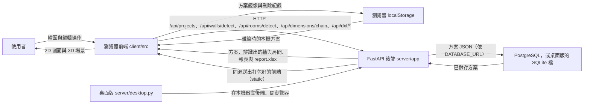
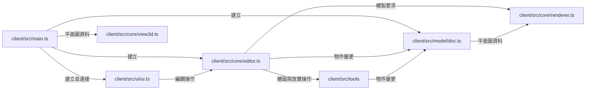
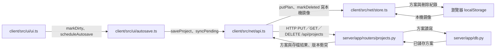
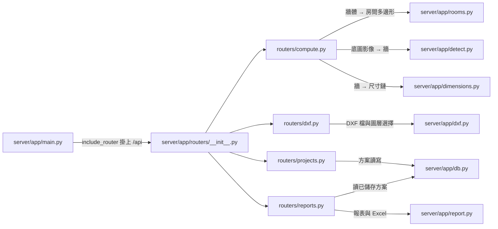

# interiordesign

用 2D 平面圖規劃室內空間，再以 3D 預覽設計成果。

## 最近更新
<!-- readme:recent 自動產生，不要手改 -->
- [2026-11-18](docs/worklog/2026-11-18.md)：docs(readme): 更新最近更新
- [2026-11-17](docs/worklog/2026-11-17.md)：docs(readme): 更新最近更新
- [2026-11-16](docs/worklog/2026-11-16.md)：更新專案說明文件，整理近期變更；重寫系統架構說明，加入整體與子系統圖，並核對實際程式碼
- [2026-11-15](docs/worklog/2026-11-15.md)：docs(readme): 更新最近更新
- [2026-11-13](docs/worklog/2026-11-13.md)：docs(readme): 改版（舊版搬到 docs/）
- [2026-11-02](docs/worklog/2026-11-02.md)：行走模式三個操作錯：分割畫面鍵盤給 3D、Q／E 不轉家具、方向鍵能走能轉身；審查建議：行走時 Delete 不刪看不到的選取、Q／E 鍵燈不亮、說明與規格補方向鍵
- [2026-11-01](docs/worklog/2026-11-01.md)：修正行走模式，改成按住滑鼠左鍵拖曳轉頭，放開後即可切換分頁，按一次 Esc 就能退出；修復衛浴淋浴區閃爍，以及 3D 畫面調整畫質或視窗大小時偶爾閃黑的問題
<!-- /readme:recent -->

## 這是什麼
<!-- readme:about 2026-11-13 -->
Interior Designer 是一套室內設計繪圖工具，適合想規劃房間格局、家具與照明配置的人使用。可以畫牆、門窗和房間，擺放家具與水電設備，標註尺寸，並切換到 3D 查看空間。

工具支援房間面積計算、照度分析、空間健檢及第一人稱行走，也能匯出圖面、報表和 3D 模型。除了瀏覽器版本，另有使用本機資料庫的桌面版。

目前已有完整的繪圖、預覽與匯出功能，近期持續改善行走操作、3D 效能與空間健檢。工作紀錄中仍列有廚房與陽台之間的牆面落差待處理。
<!-- /readme:about -->

## 架構
<!-- readme:arch 2026-11-16 -->
前端是使用者操作的地方。介面把繪圖與編輯操作交給編輯器，編輯器管理平面圖資料，並將變更呈現在 2D 畫布與 3D 場景中。

後端（FastAPI，`server/app/main.py`）提供方案儲存、房間與牆體辨識、尺寸鏈、DXF 匯入及報表。伺服器版（Docker）使用 PostgreSQL，前端打包後由同一個後端當靜態網站送出；桌面版 `server/desktop.py` 把後端、打包好的前端和一個 SQLite 檔包成單一程式，開瀏覽器當視窗。用哪種資料庫由 `DATABASE_URL` 決定。

瀏覽器也會在 localStorage 保留方案的本機鏡像（`client/src/net/store.ts`）；離線時仍可編輯，恢復連線後再補送尚未同步的變更。


```mermaid
flowchart LR
    User["使用者"] -->|繪圖與編輯操作| Front["瀏覽器前端 client/src"]
    Front -->|2D 圖面與 3D 場景| User
    Front -->|方案鏡像與刪除紀錄| Local["瀏覽器 localStorage"]
    Local -->|離線時的本機方案| Front
    Front -->|"HTTP /api/projects、/api/walls/detect、/api/rooms/detect、/api/dimensions/chain、/api/dxf/*"| API["FastAPI 後端 server/app"]
    API -->|"方案、辨識出的牆與房間、報表與 report.xlsx"| Front
    API -->|"方案 JSON（依 DATABASE_URL）"| DB["PostgreSQL，或桌面版的 SQLite 檔"]
    DB -->|已儲存方案| API
    API -->|"同源送出打包好的前端（static）"| Front
    Desktop["桌面版 server/desktop.py"] -->|"在本機啟動後端、開瀏覽器"| API
```

### 前端編輯與顯示


```mermaid
flowchart LR
    Main["client/src/main.ts"] -->|建立並連接| UI["client/src/ui/ui.ts"]
    Main -->|建立| Editor["client/src/core/editor.ts"]
    Main -->|建立| Doc["client/src/model/doc.ts"]
    Main -->|平面圖資料| View3D["client/src/core/view3d.ts"]
    UI -->|編輯操作| Editor
    Editor -->|物件變更| Doc
    Editor -->|繪圖與放置操作| Tools["client/src/tools"]
    Tools -->|物件變更| Doc
    Editor -->|繪製要求| Renderer["client/src/core/renderer.ts"]
    Doc -->|平面圖資料| Renderer
```

### 存檔與同步


```mermaid
flowchart LR
    UI["client/src/ui/ui.ts"] -->|"markDirty、scheduleAutosave"| Auto["client/src/ui/autosave.ts"]
    Auto -->|"saveProject、syncPending"| API["client/src/net/api.ts"]
    API -->|"putPlan、markDeleted 寫本機鏡像"| Store["client/src/net/store.ts"]
    Store -->|方案與刪除紀錄| Local["瀏覽器 localStorage"]
    Local -->|本機鏡像| Store
    API -->|"HTTP PUT／GET／DELETE /api/projects"| Projects["server/app/routers/projects.py"]
    Projects -->|方案讀寫| DB["server/app/db.py"]
    DB -->|已儲存方案| Projects
    Projects -->|方案與存檔結果、版本衝突| API
```

### 後端處理


```mermaid
flowchart LR
    Main["server/app/main.py"] -->|"include_router 掛上 /api"| Routes["server/app/routers/__init__.py"]
    Routes --> Compute["routers/compute.py"]
    Routes --> DxfR["routers/dxf.py"]
    Routes --> Projects["routers/projects.py"]
    Routes --> Reports["routers/reports.py"]
    Compute -->|"牆體 → 房間多邊形"| Rooms["server/app/rooms.py"]
    Compute -->|"底圖影像 → 牆"| Detect["server/app/detect.py"]
    Compute -->|"牆 → 尺寸鏈"| Dim["server/app/dimensions.py"]
    DxfR -->|"DXF 檔與圖層選擇"| DXF["server/app/dxf.py"]
    Projects -->|方案讀寫| DB["server/app/db.py"]
    Reports -->|讀已儲存方案| DB
    Reports -->|"報表與 Excel"| Report["server/app/report.py"]
```

| 資料夾 | 放什麼 |
|---|---|
| `client/src` | 前端入口、編輯器、資料模型、工具與介面 |
| `client/public` | 前端使用的靜態資源與材質貼圖 |
| `client/test` | 前端測試 |
| `server/app` | 後端 API、資料庫存取、辨識與報表 |
| `server/scripts` | 資料遷移與版本回填腳本 |
| `server/tests` | 後端測試 |
| `schema` | 產生的平面圖資料格式定義 |
| `bench` | 效能與功能驗證腳本 |
| `scripts` | 資料處理、資源下載與程式產生腳本 |
| `tools` | 專案檢查工具 |
| `docs` | 設計規則、規格與工作紀錄 |
| `docs/worklog` | 每日工作日誌 |
| `docker` | 容器啟動設定 |
| `packaging` | 安裝程式設定 |
<!-- /readme:arch -->

## 怎麼跑
<!-- readme:run 2026-11-13 -->
本機開發需要 Node.js 20 以上、Python 3.11 以上及 PostgreSQL。安裝依賴並建立資料庫後，啟動前端與後端：

```bash
npm install
npm run setup:py
createdb interior_design
npm run dev
```

開啟 http://localhost:5180。若需要額外的家具模型，可執行 `npm run assets`；不下載時仍可使用，但部分家具會以簡化形狀顯示。

使用 Docker 啟動：

```bash
docker compose up --build
```

開啟 http://localhost:18791。需要熱重載的開發模式可執行：

```bash
docker compose -f docker-compose.dev.yml up --build
```

開啟 http://localhost:5180。

執行型別檢查、資料格式產生結果檢查，以及前後端測試：

```bash
npm test
```

完整驗收需先啟動 `npm run dev`，再執行：

```bash
npm run verify:all
```

桌面版須在目標平台上建置：

```bash
./build-desktop.sh
```

Windows 使用：

```bat
build-desktop.bat
```
<!-- /readme:run -->

## 工作日誌
每天做了什麼在 [`docs/worklog/`](docs/worklog/)，一天一份，檔名就是日期。
舊版 README：[`docs/README-舊版.md`](docs/README-舊版.md)

<!-- 標記外面的內容不會被自動覆寫 -->
